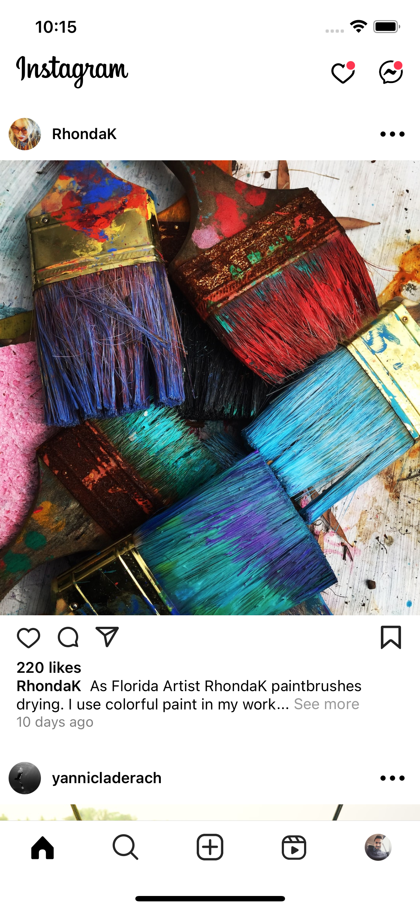

## React-Native-Instagram

### Tools
-   Redux-Toolkit
-   React-Native-Navigation
-   React-Native-Bottom-Sheet
-   Dayjs

    <h3>Homepage</h3>
    
    

    <h3>Messages / Notification</h3>
    
    

    <h3>Profile</h3>
    
    
    

    <h3>Saved Photos</h3>
    
    

